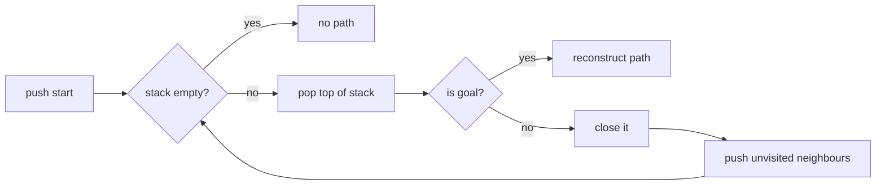
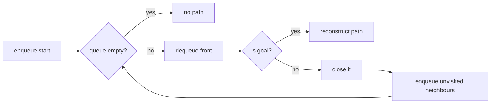
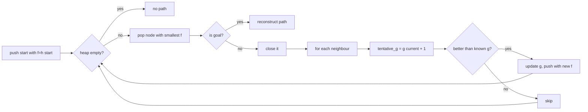
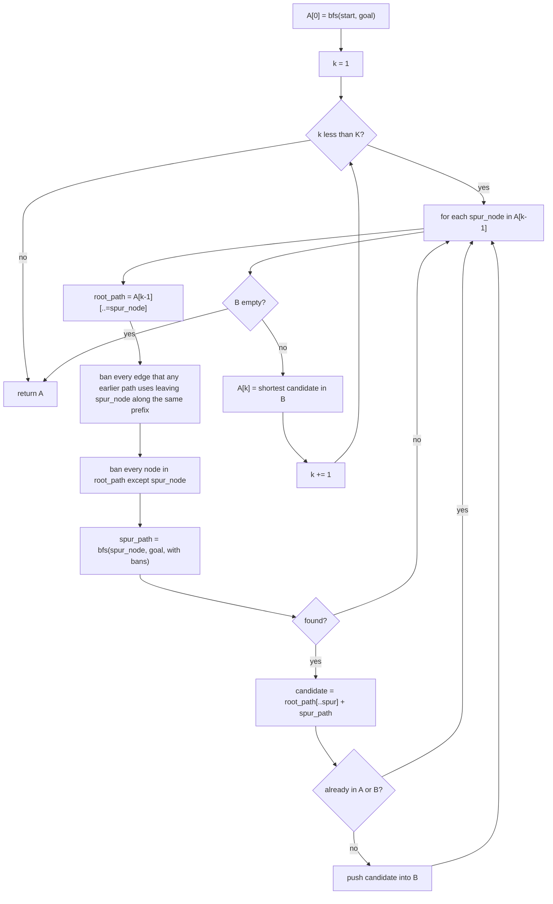

# Algorithms

All algorithms share the same grid model — a 4-connected, unit-cost
lattice where `maze[y][x] == Cell::Wall` is impassable. The three
single-path algorithms (DFS, BFS, A*) advance node-by-node and share
the same `step()` interface; the multi-path one (K-Shortest) runs to
completion in one call.

## Comparison

| | DFS | BFS | A* | K-Shortest |
| --- | --- | --- | --- | --- |
| Frontier | Stack (`Vec`) | Queue (`VecDeque`) | Min-heap on `f` | n/a (one-shot) |
| Output | One path | One path | One path | Up to `k` paths |
| Optimal? | No | Yes | Yes, if `h` admissible | Yes (every result is loopless and ranked by length) |
| Memory | Lowest | Mid | Highest (heap + g-scores) | k · path length |
| Uses heuristic? | No | No | Yes | No |
| Step-by-step? | Yes | Yes | Yes | No — single `step()` solves it |
| Typical use | Quick reachability | Shortest path, simple | Shortest path, focused | Visualising alternatives |

## DFS



Because the next node is always the most-recently-added one, DFS dives
down a single corridor before backtracking. This is great for "is there
*any* path?" but the first path it finds is rarely the shortest.

## BFS



BFS expands the frontier as a wave. On an unweighted grid, the first
time it reaches the goal is along a shortest path. Memory grows with
the area of the explored disc.

## A\*

A* prioritises nodes by `f(n) = g(n) + h(n)`:

- `g(n)` = exact cost from start to `n` (here: edges traversed).
- `h(n)` = heuristic estimate of the remaining cost to the goal.



If `h` is **admissible** (never overestimates) the path A* returns is
optimal. If `h` is also **consistent** (`h(n) ≤ cost(n, n') + h(n')` for
every neighbour `n'`), no node ever needs to be reopened — which is why
we can safely keep a closed set and short-circuit stale heap entries.

### Heuristics

| Heuristic | Formula | Admissible on 4-grid? | Notes |
| --- | --- | --- | --- |
| **Manhattan** | `|dx| + |dy|` | ✔ tight | Default. Best general choice. |
| **Euclidean** | `√(dx² + dy²)` | ✔ but loose | Explores more nodes; useful for comparison. |
| **Chebyshev** | `max(|dx|, |dy|)` | ✘ overestimates | Designed for 8-grids; here it can over-relax and miss the optimum. |
| **Zero** | `0` | ✔ trivially | A* degenerates to Dijkstra / uniform-cost search. |

### Why "Manhattan" was buggy in v0.1

The original heuristic computed `dy` as `a.0.abs_diff(b.1)` — mixing
the X of one point with the Y of the other. That happened to be
*close enough* on roughly-square mazes that nothing crashed, but it
made A* lose its admissibility guarantee. The unit test
`manhattan_is_symmetric_in_axes` pins the corrected formula.

## Step-by-step vs. layer-by-layer

The earlier `step_bfs_layer` mode is gone — it expanded a whole BFS
"ring" per click, which made step-mode and solve-mode behave
inconsistently. The current `step()` always advances exactly one node,
regardless of algorithm. If you want frame-rate animation, raise the
speed (e.g. 10 ms/step).

## K-Shortest paths (Yen's algorithm)

K-Shortest is the only multi-output algorithm. It returns up to `k`
loopless paths between start and goal, sorted by length (shortest
first). The visualiser draws every result in its own colour:

| Path index | Colour      |
| ---------- | ----------- |
| 0          | Gold *(shortest)* |
| 1          | Orange      |
| 2          | Pink        |
| 3          | Purple      |
| 4          | Blue        |
| 5          | Teal        |
| 6          | Green       |
| 7          | Khaki       |

The palette wraps if `k > 8`.

### How it works

Yen's algorithm builds the list incrementally:



The edge bans are what prevent Yen from rediscovering paths already in
`A`. The node bans (everything in the root path except the spur node
itself) keep each spur path loopless. Without those bans you'd get
"shortest path that revisits the start", which isn't useful.

### Why it doesn't step

Each iteration of the outer loop runs a fresh BFS over the whole grid
with a different ban set, so the "current frontier" the user sees would
flicker between unrelated searches. The visualiser deliberately skips
the per-node animation here and just shows the final result. If you
want to watch *one* of the paths get discovered, switch to BFS — the
shortest k-path is the same path BFS finds.

### Complexity

For a grid with `n` reachable cells and target `k`:

- Each spur BFS is O(n).
- Each iteration runs at most `len(A[k-1])` spur BFSes.
- Path lengths are bounded by `n`, so outer-loop cost is O(k · n²) worst case.

In practice, on a 40×40 maze with k=10 it returns in well under a frame.
On much larger mazes the spinner caps at 32 mostly to prevent typos.

## Stale heap entries in A\*

When we discover a cheaper `g` for a node already in the open set we
*don't* try to remove it from `BinaryHeap` (which would be O(n)). We
just push a new entry with the lower `f`. The pop loop:

```text
while let Some(node) = heap.pop() {
    if open_set.remove(&node.coord) {
        return Some(node.coord);   // this is the real one
    }
    // else: stale — keep popping
}
```

The `open_set` is the source of truth for membership; the heap is only
the source of truth for ordering. This is a standard trick to keep A*
clean without a "decrease-key" operation.
