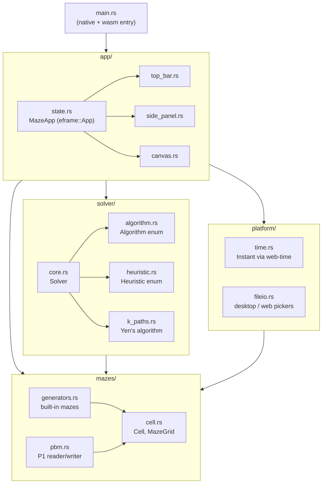
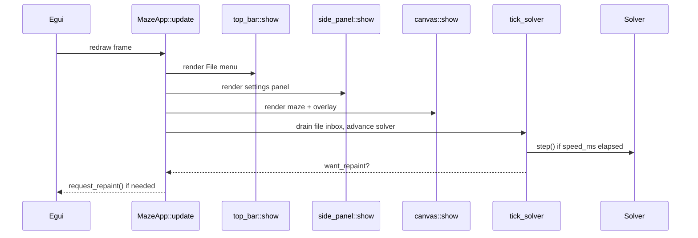
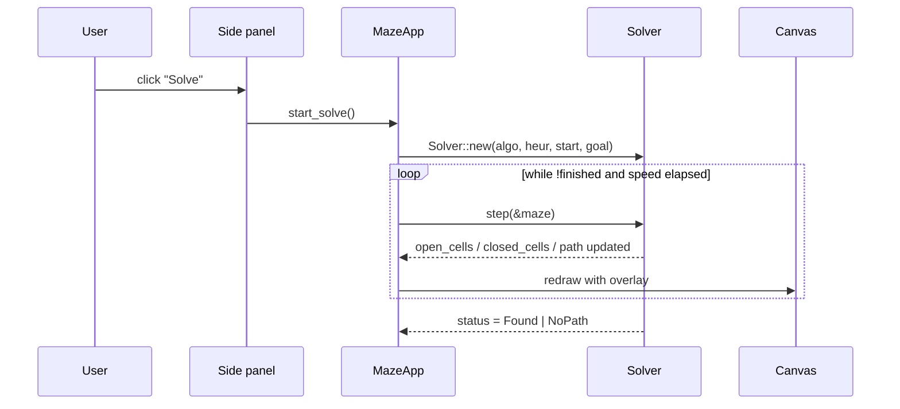
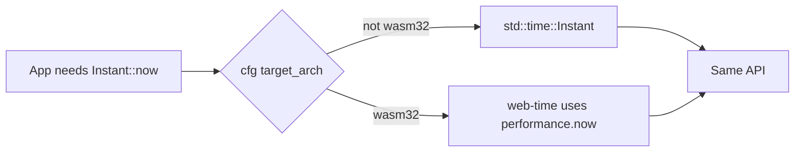
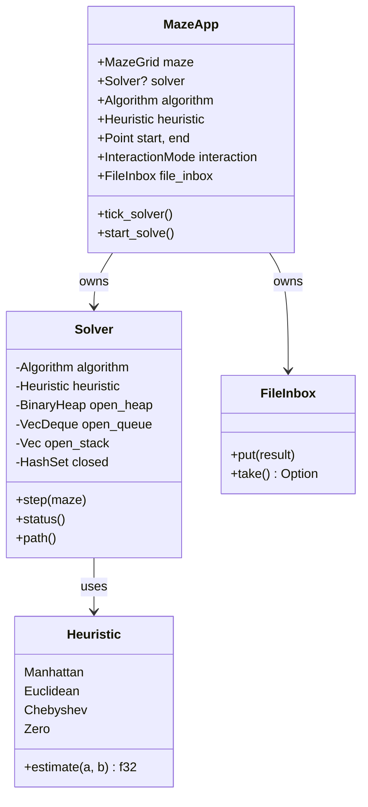

# Architecture

This document explains how the crate is organised and how data flows
through it at runtime.

## Module map

Each module owns exactly one concern:

- **`mazes/`** — what a maze is and how to make / load / save one.
- **`solver/`** — how to search for a path. Knows nothing about UI.
- **`platform/`** — abstracts the two things that genuinely differ
  between native and wasm: monotonic time and file pickers.
- **`app/`** — egui front-end. Renders state, dispatches user actions.

## Update loop

`MazeApp::update` runs once per egui frame and does four things, in order:

`tick_solver` is intentionally pulled out of the side-panel callback so
the timing logic is testable and the UI code stays declarative.

## How a solve happens

## The web timer fix

The earlier version of this project called `std::time::Instant::now()`
directly. That panics on `wasm32-unknown-unknown` because the platform
has no built-in monotonic clock.

`platform::time` re-exports
[`web-time::Instant`](https://docs.rs/web-time), which:

- on native = `std::time::Instant`,
- on wasm = backed by `performance.now()`.

Every timing-sensitive call site (`last_step_time`, `last_finish_time`)
goes through this module, so the same code drives both runtimes.

## State ownership

Only `MazeApp` is mutable at the top level — `Solver` borrows the maze
immutably during each `step()`, so wall edits and solver iteration cannot
race.
